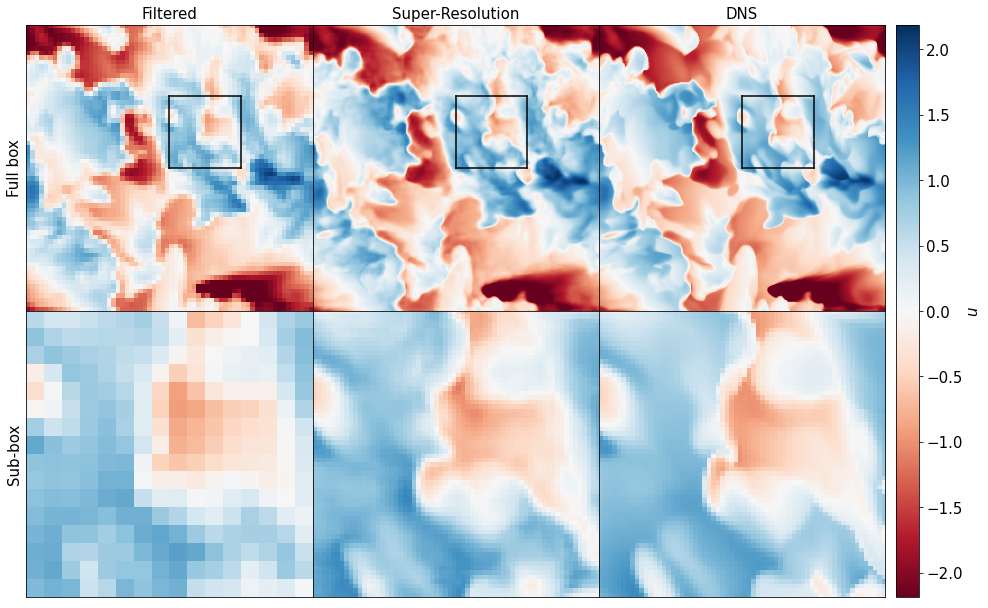
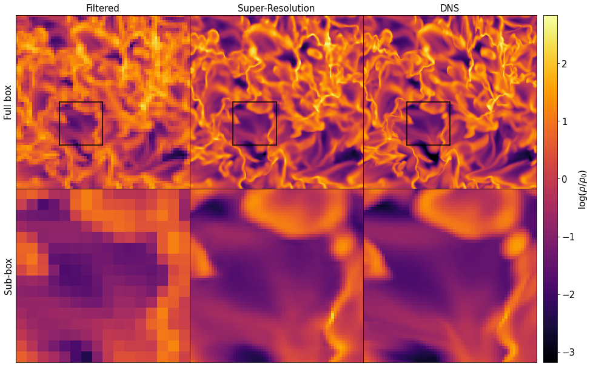
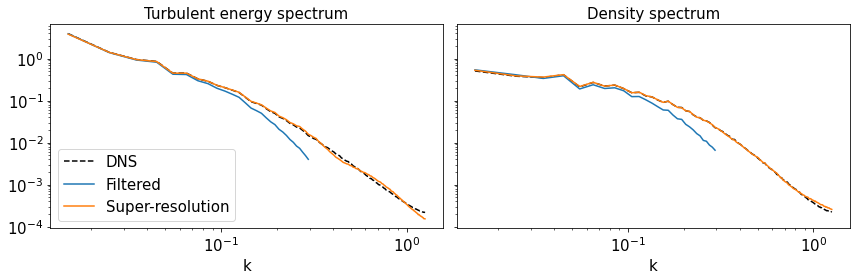

# Super-Resolution of ISM turbulence

[Overleaf draft](https://www.overleaf.com/5721299619yyjhjshpgggb)

## Model

The upsampling model is based on a GAN with a similar architecture as models used for super-resolution of 2D images.

The generator is a convolutional neural network with redidual blocks and upsampling layers based on nearest neighbor interpolation. The discriminator has a convolutional architecture, followed by fully connected layers for binary classification.

The adversarial loss of the generator is enhanced with a content loss which is designed to capture relevant physical differences between true high-resolution turbulence and super-resolved fields.

## Data

The training data is obtained from independent fully-developed turbulent fields (velocity and log-density). We run DNS simulations of isothermal ISM turbulence in periodic boxes of 100 parsec width and  cells with the RAMSES code. These simulation are evolved for 3.5Myr to fully develop the inherent turbulence. The DNS fields are then downsampled by a factor or 4 to generate our low-resolution snapshots. Training data correspond to pairs of sub-boxes of  /  for respectively high- / low-resolution.

Scripts used to generate our data are available in the [dataBuilder](dataBuilder) directory.
If you want to use our dataBuilder, pull this repository with the --recursive flag.

## Requirements

python3, tensorflow>2.0, h5py, numpy

## Results

### Velocity slice

### Density slice

### Energy and Density spectra

